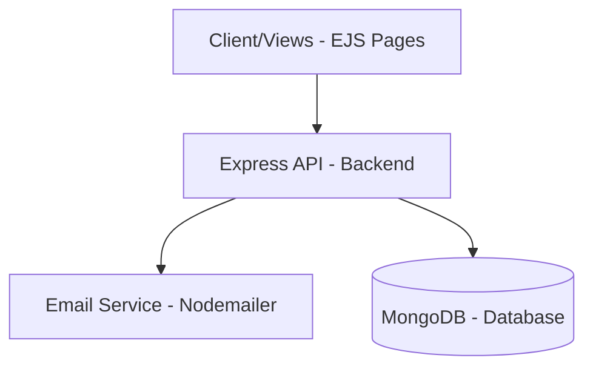
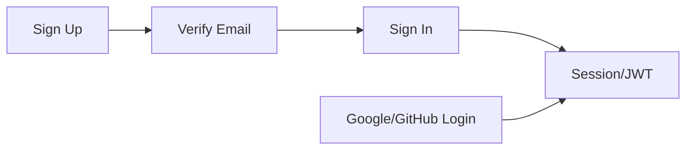

# Book Library Management System

A comprehensive full-stack digital library management system built with Node.js, featuring user authentication, book management, reviews, favorites, and email notifications.

[](https://opensource.org/licenses/ISC)
[](https://nodejs.org)
[](https://www.mongodb.com/)
[](https://github.com/lwshakib/book-library-management-api/actions/workflows/ci.yml)

## 🚀 Features

### Core Functionality

- **User Management**: Complete user registration, authentication, email verification, and password reset functionality
- **Book Management**: Full CRUD operations for books with cover image uploads
- **Review System**: User reviews and ratings for books with aggregated statistics
- **Favorites**: Personal bookmark system for users to save their favorite books
- **Search & Filter**: Advanced book search with filtering, sorting, and pagination
- **Profile Management**: User profile viewing and management
- **CI/CD Pipeline**: Automated code quality checks via GitHub Actions

### Authentication & Security

- **JWT Authentication**: Secure token-based authentication with access tokens
- **OAuth Integration**: Google and GitHub OAuth2 support for social login
- **Email Verification**: Email-based account verification system
- **Password Security**: bcrypt hashing with secure password reset flow
- **Rate Limiting**: Protection against abuse and DDoS attacks (5000 requests per 15 minutes)
- **Session Management**: Secure session handling with Passport.js
- **CORS Protection**: Configurable cross-origin resource sharing

### Email System

- **Direct Email Delivery**: Reliable email delivery using Nodemailer
- **Multiple Templates**: Welcome emails, verification, password reset, and security alerts
- **Development Support**: MailHog integration for local email testing
- **Production Ready**: Gmail SMTP support for production environments

### API & Documentation

- **RESTful API**: Well-structured REST endpoints following best practices
- **Swagger Documentation**: Interactive API documentation at `/docs`
- **Input Validation**: Zod schema validation for all inputs
- **Error Handling**: Comprehensive error management with custom error classes
- **Logging**: Detailed application and HTTP logging using Winston and Morgan

### Frontend Views

- **Server-Side Rendering**: EJS templates for dynamic content
- **Responsive Design**: Mobile-friendly interface
- **Book Catalog**: Browse and search books with pagination
- **Book Details**: Detailed book information with reviews
- **User Profile**: View and manage user profile
- **Favorites Page**: Manage favorite books

## 🏗️ Architecture

This project follows a monolithic architecture with modular design:

```
┌─────────────────┐
│   Client/Views  │
│   (EJS Pages)   │
└────────┬────────┘
         │
         ▼
┌─────────────────┐    ┌─────────────────┐
│   Express API   │───►│  Email Service  │
│   (Backend)     │    │  (Nodemailer)   │
└────────┬────────┘    └─────────────────┘
         │
         ▼
┌─────────────────┐
│    MongoDB      │
│   (Database)    │
└─────────────────┘
```



## 📁 Project Structure

```
book-library-management-api/
├── .github/                 # GitHub configuration
│   ├── workflows/           # CI/CD pipelines (GitHub Actions)
│   ├── ISSUE_TEMPLATE/      # Standardized issue templates
│   └── pull_request_template.md
├── src/
│   ├── controllers/         # Route handlers and business logic
│   ├── models/              # Mongoose database models
│   │   └── auth/            # User and token models
│   ├── routes/              # API route definitions
│   ├── middlewares/         # Custom middleware
│   ├── utils/               # Utility functions & email templates
│   ├── schema/              # Zod validation schemas
│   ├── logger/              # Logging configuration (Winston + Morgan)
│   ├── services/            # Business services (email, MongoDB, passport)
│   ├── views/               # EJS templates
│   ├── seeds/               # Database seeders
│   ├── data/                # Static data (books.json)
│   ├── scripts/             # Utility scripts (DB teardown)
│   ├── swagger.yaml         # API documentation
│   ├── app.js               # Express app configuration
│   ├── index.js             # Application entry point
│   ├── envs.js              # Environment variable exports
│   └── constants.js         # Application constants
├── public/                  # Static assets (css, images)
├── logs/                    # Application logs
├── docker-compose.yml       # Development services & Full App orchestration
├── Dockerfile               # Application containerization
├── package.json
├── pnpm-lock.yaml
├── .env.example
├── .prettierc.yaml          # Code formatting configuration
├── .prettierignore
├── nodemon.json
├── README.md
├── CONTRIBUTING.md
├── CODE_OF_CONDUCT.md
└── LICENSE
```

## 🛠️ Tech Stack

### Backend

- **Runtime**: Node.js (v14+) with ES6 modules
- **Framework**: Express.js v5
- **Database**: MongoDB with Mongoose ODM
- **Authentication**: JWT, Passport.js (Google, GitHub OAuth)
- **Validation**: Zod schema validation
- **Documentation**: Swagger/OpenAPI
- **Logging**: Winston + Morgan
- **Security**: bcryptjs, express-rate-limit, CORS
- **File Upload**: Multer
- **Email**: Nodemailer
- **Template Engine**: EJS
- **Formatting**: Prettier
- **CI/CD**: GitHub Actions

### Infrastructure

- **Database**: MongoDB
- **Email Testing**: MailHog
- **Containerization**: Docker & Docker Compose
- **Package Manager**: pnpm
- **Development**: Nodemon for hot reloading

## 🚀 Quick Start

### Prerequisites

- Node.js (v14 or higher)
- [pnpm](https://pnpm.io/) (v8 or higher)
- Docker and Docker Compose
- Git

### Installation

1. **Clone the repository**

   ```bash
   git clone https://github.com/lwshakib/book-library-management-api.git
   cd book-library-management-api
   ```

2. **Start development services**

   ```bash
   # Start MongoDB and MailHog
   docker-compose up -d
   ```

3. **Install dependencies**

   ```bash
   pnpm install
   ```

4. **Set up environment variables**

   Copy `.env.example` to `.env` and update the values:

   ```bash
   cp .env.example .env
   ```

   **Required environment variables:**

   ```env
   # Server Configuration
   PORT=7000
   BACKEND_URL=http://localhost:7000
   CLIENT_SSO_REDIRECT_URL=http://localhost:7000
   NODE_ENV=development

   # Database
   MONGODB_URI=mongodb://localhost:27017
   DB_NAME=book-library

   # JWT Secrets (change these!)
   ACCESS_TOKEN_SECRET=your_secure_access_token_secret
   EXPRESS_SESSION_SECRET=your_secure_session_secret

   # OAuth (optional for development)
   GOOGLE_CLIENT_ID=your_google_client_id
   GOOGLE_CLIENT_SECRET=your_google_client_secret
   GOOGLE_CALLBACK_URL=http://localhost:7000/auth/google/callback

   GITHUB_CLIENT_ID=your_github_client_id
   GITHUB_CLIENT_SECRET=your_github_client_secret
   GITHUB_CALLBACK_URL=http://localhost:7000/auth/github/callback

   # Email Configuration
   # For development (MailHog)
   MAILHOG_SMTP_HOST=localhost
   MAILHOG_SMTP_PORT=1025

   # For production (Gmail)
   GMAIL_USER=your-email@gmail.com
   GMAIL_PASS=your-app-password
   ```

5. **Start the application**

   ```bash
   # Development mode with hot reload
   pnpm dev

   # Production mode
   pnpm start
   ```

6. **Access the application**
   - **Application**: http://localhost:7000
   - **API Documentation**: http://localhost:7000/docs
   - **Health Check**: http://localhost:7000/health
   - **MailHog UI**: http://localhost:8025 (for email testing)

## 📚 API Documentation

### Authentication Endpoints



- `POST /auth/sign-up` - User registration
- `POST /auth/sign-in` - User login
- `POST /auth/sign-out` - User logout
- `POST /auth/forget-password` - Request password reset
- `POST /auth/reset-password` - Reset password with token
- `POST /auth/verify-email` - Verify email address
- `GET /auth/google` - Google OAuth login
- `GET /auth/github` - GitHub OAuth login

### Book Management

- `GET /books` - Get all books (with pagination, filtering, sorting)
- `GET /books/:id` - Get book by ID
- `POST /books` - Create new book (Admin only)
- `PUT /books/:id` - Update book (Admin only)
- `DELETE /books/:id` - Delete book (Admin only)
- `POST /books/:id/upload-image` - Upload book cover image

### Reviews

- `GET /reviews` - Get all reviews
- `GET /reviews/book/:bookId` - Get reviews for a specific book
- `POST /reviews` - Create new review (Authenticated users)
- `PUT /reviews/:id` - Update review (Review owner only)
- `DELETE /reviews/:id` - Delete review (Review owner only)

### Favorites

- `GET /favorites` - Get user's favorite books
- `POST /favorites` - Add book to favorites
- `DELETE /favorites/:bookId` - Remove book from favorites

### Web Pages

- `GET /` - Home page with book catalog
- `GET /book/:id` - Book details page
- `GET /profile` - User profile page
- `GET /favorites` - User favorites page

For complete API documentation with request/response examples, visit: http://localhost:7000/docs

## 🔧 Development

### Available Scripts

```bash
pnpm start             # Start production server
pnpm dev               # Start development server with hot reload
pnpm build             # Run build validation
pnpm format            # Format code with Prettier
pnpm format:check      # Check code formatting
pnpm seed              # Seed admin user and books into the database
pnpm mongodb:teardown  # Drop the database (use with caution)
```

### Database Seeding

To populate the database with sample books:

```bash
# The seed endpoint is available at /seeds/add-books
# Access it through the browser or make a POST request
curl -X POST http://localhost:7000/seeds/add-books
```

### Code Style

The project uses Prettier for code formatting:

- Configuration: `.prettierc.yaml`
- Ignore file: `.prettierignore`

### Logging

- **Winston**: Application-level logging (info, error, debug)
- **Morgan**: HTTP request logging
- Log files are stored in the `logs/` directory

## 🐳 Docker Services

The project includes Docker Compose for easy development setup:

```bash
# Start all services
docker-compose up -d

# View logs
docker-compose logs -f

# Stop services
docker-compose down

# Rebuild services
docker-compose up -d --build
```

**Services included:**

- **MongoDB**: Database server (port 27017)
- **MailHog**: Email testing server (ports 1025, 8025)

## 🔒 Security Features

- **Rate Limiting**: 5000 requests per 15 minutes per IP
- **JWT Authentication**: Secure token-based authentication
- **Password Hashing**: bcryptjs for password security
- **CORS Protection**: Configurable cross-origin resource sharing
- **Input Validation**: Zod schema validation for all inputs
- **Session Management**: Secure session handling with Passport.js
- **Email Verification**: Email-based account verification
- **OAuth Integration**: Secure third-party authentication
- **File Upload Security**: Multer with file type and size restrictions

## 📧 Email System

The email service provides:

- **Direct Delivery**: Synchronous email delivery using Nodemailer
- **Multiple Templates**: Welcome, verification, password reset, security alerts
- **Development Support**: MailHog integration for testing
- **Production Ready**: Gmail SMTP support for production
- **HTML Templates**: Professional email templates with inline CSS

### Email Testing (Development)

1. Start MailHog: `docker-compose up -d mailhog`
2. Access MailHog UI: http://localhost:8025
3. Trigger email actions in the application
4. View sent emails in MailHog interface

### CI/CD Pipeline

Every push and pull request to the `main` branch triggers a GitHub Actions workflow that:

1. Installs dependencies via pnpm
2. Checks code formatting (`pnpm format:check`)
3. Runs the build step (`pnpm build`)

### Email Testing

Access MailHog at http://localhost:8025 to view all emails sent during development.

## 🚀 Deployment

### Production Environment Variables

```env
NODE_ENV=production
PORT=7000
BACKEND_URL=https://your-domain.com
MONGODB_URI=mongodb://your-mongodb-uri
DB_NAME=book-library
ACCESS_TOKEN_SECRET=your-secure-secret
EXPRESS_SESSION_SECRET=your-secure-secret
GMAIL_USER=your-gmail-username
GMAIL_PASS=your-gmail-app-password
```

### Production Considerations

- Use a production MongoDB instance (MongoDB Atlas recommended)
- Configure Gmail SMTP or other email service for email delivery
- Set up proper logging and monitoring
- Use environment-specific secrets (strong, random values)
- Configure proper CORS origins
- Set up SSL/TLS certificates
- Use a process manager (PM2 recommended)
- Set up reverse proxy (Nginx recommended)

## 🤝 Contributing

We welcome contributions! Please see our [CONTRIBUTING.md](CONTRIBUTING.md) file for detailed guidelines.

### Quick Contribution Guide

1. Fork the repository
2. Create a feature branch (`git checkout -b feature/amazing-feature`)
3. Commit your changes (`git commit -m 'feat: add amazing feature'`)
4. Push to the branch (`git push origin feature/amazing-feature`)
5. Open a Pull Request

## 📄 License

This project is licensed under the ISC License - see the [LICENSE](LICENSE) file for details.

## 👥 Authors

- **lwshakib** - [GitHub Profile](https://github.com/lwshakib)

## 🆘 Support

If you encounter any issues or have questions:

1. Check the [API Documentation](http://localhost:7000/docs)
2. Review the logs in `logs/` directory
3. Check the MailHog interface for email issues
4. Open an issue on [GitHub Issues](https://github.com/lwshakib/book-library-management-api/issues)

## 🙏 Acknowledgments

- Express.js team for the excellent web framework
- MongoDB team for the powerful database
- Nodemailer team for the reliable email solution
- All contributors who help improve this project

## 📝 Changelog

### v1.0.0 (Current)

- Initial release with core functionality
- User authentication and management
- Book CRUD operations
- Review and favorites system
- Email notification service
- OAuth integration (Google, GitHub)
- API documentation with Swagger
- Server-side rendering with EJS

---

**Built with ❤️ using Node.js, Express, and MongoDB**
